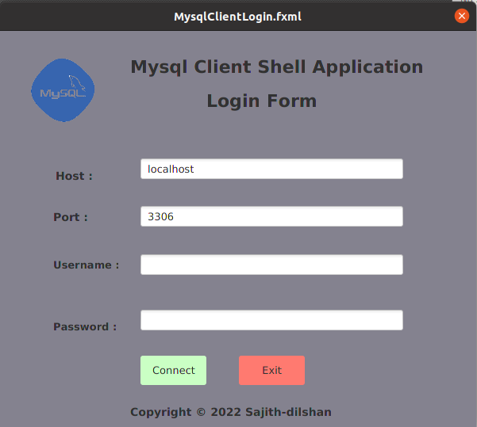
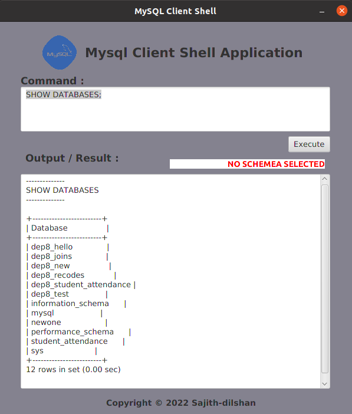

##MySQL Client Shell Application

This application is a JavaFx Application. 
That application provide graphical user interface to interract with mysql
server as a client. to developed that application I am using Java Process Builder api

##How to use this repo?
* Clone the repository first 'git clone'

* Once cloned,you can open the repository from any prefered IDE

* Build and Run!

###Prerequisites

1.JDK 1.8  
2.MySQL Server

### LICENSE
Copyright © 2022 Sajith dilshan. All Rights Reserved.
This project is licensed under [MIT](LICENSE.txt) license.